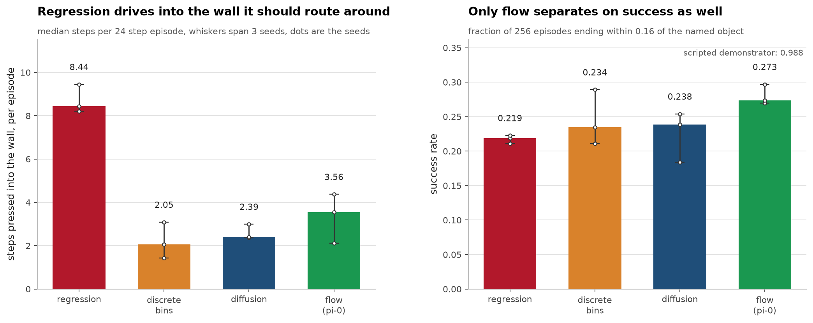
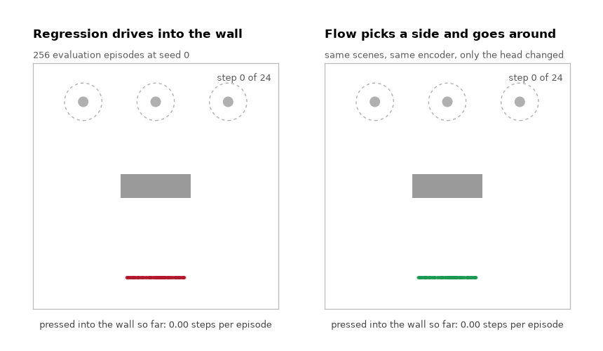
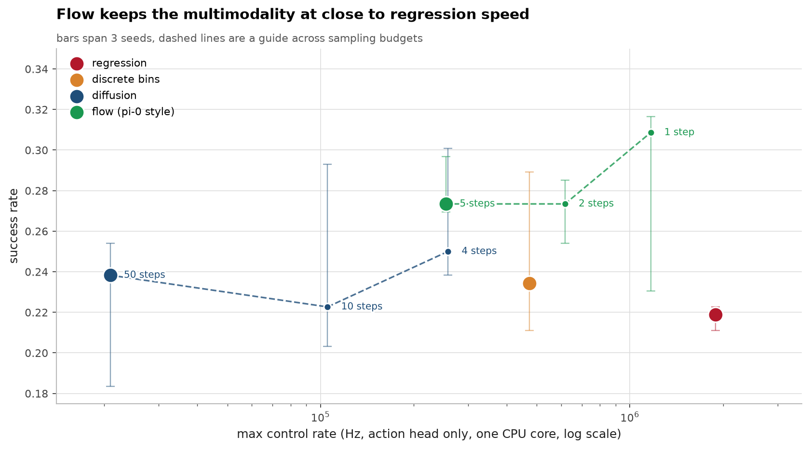
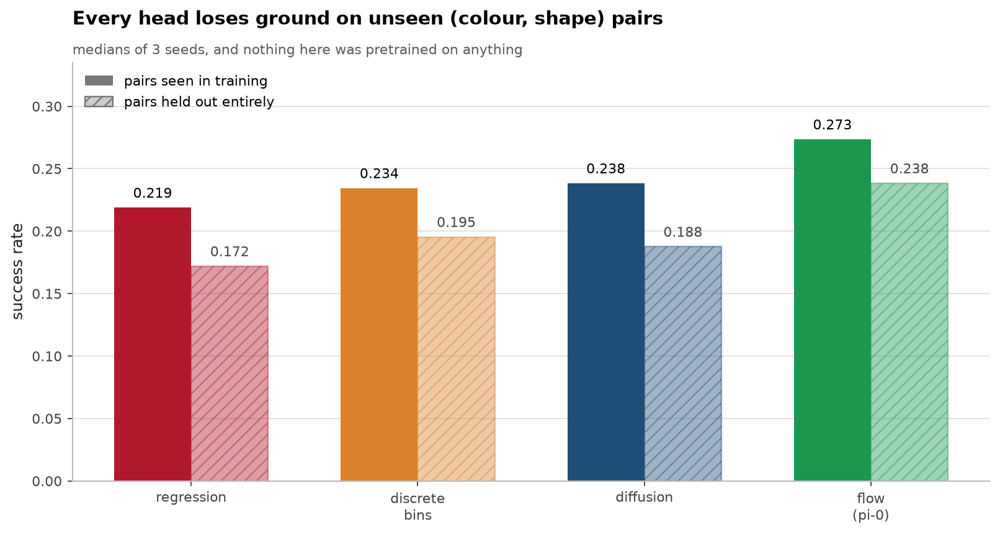

# vla-from-scratch

Four ways for a policy to emit continuous actions, compared under identical
conditions: discrete bins as tokens (RT-2), a regression head, a diffusion
policy head, and a flow matching action expert (pi-0).

That comparison is the part of this project that is not a reimplementation of
anything, and it is the part that runs on a laptop CPU. What does not run here
is the thing that makes a VLA a VLA, and section two says so before showing any
numbers.



## Scope, stated first

A real VLA puts a pretrained 1B to 3B vision language model in front of the
action head, and the claim being tested is that web scale pretraining brings
*semantic* generalisation to robotics. **This repo does not test that claim and
cannot.** The encoder here is a small CNN plus token embeddings, trained from
scratch on 19,200 transitions of a 2D task. Nothing is pretrained, so there is
no transfer to measure.

There is also no LIBERO and no ManiSkill. The simulator is 24x24 pixels of a 2D
reaching task, written directly so the repo has no simulator dependency.

What survives that reduction is the engineering question the four heads answer:
given identical perception, how should a policy represent a continuous action?
Every head below sits on the same features, trained with the same optimiser for
the same number of steps, so differences between them are about the action
representation and nothing else.

## The task, and why it has an obstacle

An agent at the bottom, three objects at the top, and an instruction naming one
of them by colour and shape. A wall sits in the middle.

The wall is the entire design. A demonstrator can route around it to the left or
the right, and both are correct, so the demonstration distribution is
**multimodal**. Measured on the demonstrations, over the steps where the
demonstrator is still routing around the wall: the left mode's lateral action
averages -0.44, the right mode's +0.44, and the two together average -0.004,
which points straight at the wall.

That last number is the whole experiment. A regression head trained with mean
squared error converges to the conditional mean, so on this data it learns to
drive into the obstacle. Without multimodality a regression head would win and
the comparison would say nothing at all.



All 256 evaluation episodes at seed 0 playing at once, same scenes and same
encoder for both, with only the action head changed. A dot turns black on a step
where the wall refused the move it asked for. The counters end on 8.44
collisions per episode against 3.56, which are also the medians across the three
seeds.

## Results
3 seeds, 800 demonstrations each, 2000 gradient steps per head, 17 minutes on a CPU.
Every figure below is recomputed from the committed results by independent
implementations in `verify/`, and CI fails if any of them disagree.

The mode averaging prediction holds. Regression spends 8.44 steps of a 24 step
episode pressed into the wall, every multimodal head spends between 2.05 and
3.56, and the seed ranges do not overlap. On success only flow separates from
regression, 0.273 against 0.219, with the other two heads in between and
overlapping. All four sit far below the scripted demonstrator's 0.988, so the
collision numbers show the mechanism rather than a solved task.

Full detail in [notes/METHODS.md](notes/METHODS.md#results).
## Latency is where flow earns its place
Each head at its default sampling budget, from `results/heads.csv`:

| head | NFE | max Hz | vs regression |
|---|---:|---:|---:|
| regression | 1 | 1,891,644 | 1.0x |
| discrete bins | 2 | 472,761 | 4.0x slower |
| flow, 5 steps | 5 | 254,558 | 7.4x slower |
| diffusion, 50 steps | 50 | 20,913 | **90x slower** |

Sweeping the sampling budget is the useful part. The table below is a second
harness, `results/step-sweep.csv`, so its flow 5 step row does not repeat the one
above exactly: 0.266 success and 251,679 Hz here against 0.273 and 254,558 in the
main run. Same head, two timing runs.

| head | steps | success | max Hz |
|---|---:|---:|---:|
| diffusion | 50 | 0.238 | 20,985 |
| diffusion | 10 | 0.223 | 105,379 |
| diffusion | 4 | 0.250 | 258,237 |
| flow | 5 | 0.266 | 251,679 |
| flow | 2 | 0.273 | 616,867 |
| **flow** | **1** | **0.309** | **1,167,180** |

Flow at one step is the fastest row here by a wide margin: 1.9x the next one, 4.6x
the flow 5 step row in the same table, and within 1.6x of regression's 1,891,644 in
the main run. It also has the highest median success, 0.309, and that half does not
hold up. Its three seeds are 0.230, 0.309 and 0.316. The 0.230 is the worst any flow
row records and sits below the medians of flow at 5 steps and flow at 2 steps, and
the full span covers the median of every other row in the table except diffusion at
10 steps. The plot below is those bars, and they overlap almost completely. Three
seeds do not separate these configurations on success.

So the claim the data supports is the narrow one. Cutting flow from 5 steps to 1
costs no success I can measure and buys 4.6x the rate. Not that one step is better.



Full detail in [notes/METHODS.md](notes/METHODS.md#latency-is-where-flow-earns-its-place).
## Generalisation



Three (colour, shape) pairs are withheld from training entirely. Every head
drops: flow from 0.273 to 0.238, regression from 0.219 to 0.172. Nothing here
was pretrained, so this measures whether the compositional structure was learned
from 19,200 in-domain transitions, not whether pretraining transfers. The real
version of this column is the one that justifies putting a VLM in the loop, and
it needs the VLM.

## What I got wrong
**I predicted action chunking would fix the dithering, and it made things worse.** The reasoning was sound: the demonstrator's choice of side is unobservable, so a head that samples independently every step can draw left then right and stall.
At chunk 6, flow fell from 0.246 success to 0.047 and its collisions went from
6.09 to 12.57. Open loop execution compounds prediction error faster than
committing to a mode buys anything on a task this reactive. Two more mistakes
are written up in the notes: a held out split that leaked until a test caught
it, and an encoder I built with no proprioception.

Full detail in [notes/METHODS.md](notes/METHODS.md#what-i-got-wrong).
## Running it

```bash
python -m venv .venv && source .venv/bin/activate
pip install -r requirements.txt
```

```bash
python -m pytest tests/ -q
```

```bash
python -m experiments.main --seeds 0 1 2 --demos 800 --steps 2000
```

```bash
python -m bench.figures
```

The sweep takes about 17 minutes on an M4 CPU. Figures read the committed
results and never re-run an experiment. The animation is the one thing that
needs agent positions rather than summary numbers, so those are recorded in
`results/rollout-traces.npz`. Delete that file and the next
`python -m bench.figures` retrains two heads at seed 0 to rebuild it, which
takes about three minutes and refuses to write anything unless it reproduces
the committed `heads.csv` row exactly.

## Layout

```
vla/envs.py      the 2D task, written directly, no simulator dependency
vla/data.py      scripted demonstrations, deliberately bimodal
vla/backbone.py  small vision language encoder, shared by every head
vla/heads.py     the four action representations, all chunk aware
vla/eval.py      closed loop rollouts and latency
experiments/     the sweep
bench/           the figures, and the plot style shared with my other repos
tests/           30 tests
```

## Sources

- **Brohan, Brown, Carbajal et al. RT-2: Vision-Language-Action Models Transfer Web Knowledge to Robotic Control. CoRL 2023.** [arXiv:2307.15818](https://arxiv.org/abs/2307.15818) The discrete bins as text tokens head.
- **Black, Brown, Darpinian et al. pi-0: A Vision-Language-Action Flow Model for General Robot Control. 2024.** [arXiv:2410.24164](https://arxiv.org/abs/2410.24164) The flow matching action expert, and the latency argument this repo measures.
- **Chi, Feng, Du et al. Diffusion Policy: Visuomotor Policy Learning via Action Diffusion. RSS 2023.** [arXiv:2303.04137](https://arxiv.org/abs/2303.04137) The diffusion head, and the clearest statement of why multimodality in demonstrations breaks regression.
- **Zhao, Kumar, Levine, Finn. Learning Fine-Grained Bimanual Manipulation with Low-Cost Hardware. RSS 2023.** [arXiv:2304.13705](https://arxiv.org/abs/2304.13705) ACT and action chunking, the idea my negative result above tested.
- **Kim, Pertsch, Karamcheti et al. OpenVLA: An Open-Source Vision-Language-Action Model. CoRL 2024.** [arXiv:2406.09246](https://arxiv.org/abs/2406.09246) The open reference point for the full system.
- **Liu, Zhu, Gao et al. LIBERO: Benchmarking Knowledge Transfer for Lifelong Robot Learning. NeurIPS 2023.** [arXiv:2306.03310](https://arxiv.org/abs/2306.03310) The benchmark this repo substitutes a toy for, and why that substitution costs the generalisation claim.

Related: [rectified-flow-from-scratch](https://github.com/aghasalim/rectified-flow-from-scratch)
builds the flow matching machinery the pi-0 style head uses here.

## Methodology

The rules this follows are in [`METHODOLOGY.md`](METHODOLOGY.md). Rule 15, say "not measured"
rather than extrapolating, is why the Scope section leads.

## Author

Aghasalim Mustafazada, third year AI student at Howest, Belgium.

<p align="center">
  <a href="https://github.com/aghasalim">
    </a>
  <a href="https://www.kaggle.com/aghasalimmustafazada">
    </a>
  <a href="https://linkedin.com/in/mustafazada">
    </a>
  <a href="https://orcid.org/0009-0001-8746-4582">
    </a>
</p>

## License

MIT, see [LICENSE](LICENSE).
